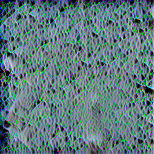
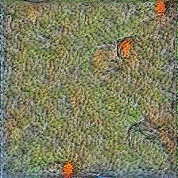
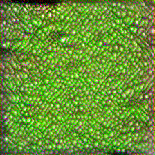
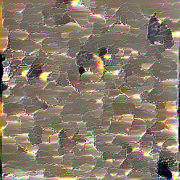
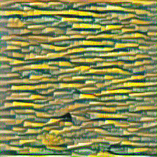
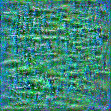
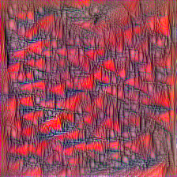
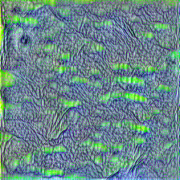
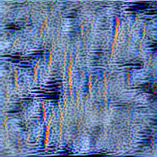

# Overview
This repository contains PyTorch implementations for training bilinear
  (second-order) CNNs. 
The series of works listed below investigates bilinear pooling of
  convolutional features for fine-grained recognition.
This repository constructs symmetric BCNNs, which represent images as
  covariance matrices of CNN activations. More details can be found in
  the PAMI 2017 paper and [Tsung-Yu Lin's PhD
  thesis](http://vis-www.cs.umass.edu/papers/tsungyu_thesis.pdf).

1. [Bilinear CNN Models for Fine-grained Visual
   Recognition](http://vis-www.cs.umass.edu/bcnn/), Tsung-Yu Lin,
   Aruni RoyChowdhury and Subhransu Maji, ICCV 2015
1. [Visualizing and Understanding Deep Texture
   Representations](http://vis-www.cs.umass.edu/bcnn/), Tsung-Yu Lin,
   and Subhransu Maji, CVPR 2016
1. [Improved Bilinear Pooling with
   CNNs](http://vis-www.cs.umass.edu/bcnn/), Tsung-Yu Lin, and
   Subhransu Maji, BMVC 2017
1. [Bilinear Convolutional Neural Networks for Fine-grained Visual
   Recognition](http://vis-www.cs.umass.edu/bcnn/), Tsung-Yu Lin,
   Aruni RoyChowdhury and Subhransu Maji, PAMI 2017
1. [Second-order Democratic
   Aggregation](http://vis-www.cs.umass.edu/o2dp/), Tsung-Yu Lin,
   Subhransu Maji and Piotr Koniusz, ECCV 2018
   

In particular, we provide the code for:
1. training BCNN models
2. training improved BCNN models (via matrix square-root normalization)
3. training the CNN models with second-order democratic aggregation
4. inverting fine-grained categories with BCNN representations

The prerequisite can be installed by `pip install -r requirements.txt`.

Links to the original implementations in Matlab and MatConvNet can
be found in the project webpages.
Please cite the appropriate papers if you find this code
useful.

## Datasets
To get started download the following datasets and point the
corresponding entries in `config.py` to the location where you
download the data (you can start with the CUB dataset first).
* Caltech-UCSD Birds: [CUB-200-2011 dataset](http://www.vision.caltech.edu/visipedia/CUB-200-2011.html).
* FGVC Aircrafts: [FGVC aircraft dataset](http://www.robots.ox.ac.uk/~vgg/data/oid/)
* Stanford Cars: [Stanford cars dataset](http://ai.stanford.edu/~jkrause/cars/car_dataset.html)
* MIT Indoor: [MIT indoor scenes dataset](http://web.mit.edu/torralba/www/indoor.html)

The results obtained from using the code in this repository are
summarized in the following table. Note that the accuracy reported here are obtained by
the softmax classifier instead of SVM (unlike the ICCV15 paper).

| Datasets    | BCNN [VGG-D]  |   Improved BCNN [VGG-D]   |
| :---        |    :----:     |           :---:           |
| Birds       |    84.1%      |           85.5%           |
| Cars        |    90.5%      |           92.5%           |
| Aircrafts   |    87.5%      |           90.7%           |

## Pre-trained models
We provide fine-tuned [BCNN](http://maxwell.cs.umass.edu/bcnn/pytorch_models/bcnn_vgg/) and [Improved BCNN](http://maxwell.cs.umass.edu/bcnn/pytorch_models/impbcnn_vgg/) models on VGG. In addition, we also provide the fine-tuned [Improved BCNN](http://maxwell.cs.umass.edu/bcnn/pytorch_models/impbcnn_densenet/) models on DenseNet. All the models can be download together in the [tar.gz file](http://maxwell.cs.umass.edu/bcnn/pytorch_models/pytorch_bcnn_pretrained_models.tar.gz). We provide the code to evaluate the pre-trained models. The models are assumed in the folder `pretrained_models`. You can run the following commands to evaluate the models:

     python test.py --pretrained_filename bcnn_vgg/cub_bcnn_vgg_models.pth.tar --dataset cub
     python test.py --pretrained_filename impbcnn_vgg/cub_impbcnn_vgg_models.pth.tar --dataset cub --matrix_sqrt_iter 5
     python test.py --model_names_list densenet --proj_dim 128 --pretrained_filename impbcnn_densenet/cub_impbcnn_densenet_models.pth.tar --dataset cub --matrix_sqrt_iter 5

## Training bilinear CNN
The following command is used to train the BCNN model with VGG-D as
backbone on the CUB dataset:

    python train.py --lr 1e-4 --optimizer adam --exp bcnn_vgg --dataset cub --batch_size 16 --model_names_list vgg
   
This will construct a bilinear model with ImageNet pretrained VGG-D
as the backbone network and start the training a linear + softmax
layer to predict the 200 categories. 
You will see the output as follows:

    Iteration 624/9365
    ----------
    Train Loss: 4.3640 Acc: 0.1890
    Validation Loss: 3.2716 Acc: 0.3643
    Iteration 1249/9365
    ----------
    Train Loss: 2.3581 Acc: 0.5791
    Validation Loss: 2.0965 Acc: 0.5865
    Iteration 1874/9365
    ----------
    Train Loss: 1.4570 Acc: 0.7669
    Validation Loss: 1.6335 Acc: 0.6717

After the linear classifier is trained, end-to-end fine-tuning will
start automatically (as a comparision point the validation accuracy
reaches 76.2% on CUB after 40mins on a NVIDIA TitanX GPU).
The intermediate checkpoints, models, and the results can be found in the folder
`../exp/cub/bcnn_vgg`. 
We used the standard training split from Birds and
Cars, and the training + val split from Aircrafts for training. 
The validation set is set as `test`. See `config.py` file for details
and the corresponding dataset loaders.
The test accuracy can be read off
directly from the log file `train_history.txt` (see the table above
for the final accuracy).

## Training improved bilinear CNN
These incorporate matrix normalization layers. In particular the
covariance representations with matrix square-root function, 
implemented efficiently using iterative methods presented in the
BMVC17 paper. 
The following command is used to train the model:
    
    python train.py --lr 1e-4 --optimizer adam --matrix_sqrt_iter 5 --exp impbcnn_vgg --batch_size 16 --dataset cub --model_names_list vgg
    
The intermediate checkpoints, models, and the results can be found in
the folder `../exp/cub/impbcnn_vgg`. Adding the matrix normalization
layer adds little overhead to the feed-forward computation but
provides consistent improments in accuracy as seen in the table above.

Replacing the VGG-D networks with a DenseNet or ResNet provides
further gains. 
However extracting second-order representations requires significantly
more memory since the emebedding dimension of the activations is 1920 (thus the
covariance matrix is 1920x1920).
The code performs a low-rank projection to the feature before
computing the outer product (the dimension can be controlled using the
argument `proj_dim`.)
The following command is used to train a DenseNet based model:

    python train.py --lr 1e-4 --optimizer adam --matrix_sqrt_iter 5 --exp impbcnn_desnsenet --batch_size 16 --dataset cub --model_names_list densenet --proj_dim 128 
    
| Datasets    |   Birds  |   Cars   |   Aircrafts    |
| :---        |  :----:  |   :---:  |     :--:       |
| Accuracy       |   87.5%  |   92.9%  |     90.6%      | 

## Training second-order democratic aggregation
This provides an alternative to reweighting feature importance by democratic aggregation. The approach can be combined with Tensor Sketch to reduce feature dimension. The following commands reproducing the result (84.3% accuracy) on MIT Indoor dataset without end-to-end fine-tuning using ResNet-101 reported in ECCV'18 paper:

    python train.py --init_lr 1 --init_wd 1e-5 --optimizer sgd --exp democratic_resnet_sketch --dataset mit_indoor --pooling_method sketch_gamma_demo --model_names_list resnet --no_finetune --init_epoch 70 
    
The accuracy can be read off from the log file `train_init_history.txt` located in `../exp/cub/sketch_gamma_demo`. You can also train the model end-to-end. The following command is used to train the model with VGG-D as backbone. 

    python train.py --lr 1e-4 --optimizer adam --exp democratic_vgg --dataset cub --batch_size 16 --pooling_method gamma_demo --model_names_list vgg
    
The intermediate checkpoints, models, and the results can be found in the folder `../exp/cub/democratic_vgg`.

## Visualizing fine-grained categories as textures
Second-order representations are known to capture texture properties
(also see the work in Style transfer [Gatys et al.] and Covariance
representations [Portilla and Simoncelli]).
Hence by visualizing maximal images for each category according to the
bilinear model we can gain some insights into what texture are different
categories. 
The approach is based on gradient-based optimization of the inputs to
model to maximize the score of target categories.
The following command computes inverses for all categories in the
birds dataset:

    
    python inversion.py --exp_dir invert_categories
    
The code starts by training softmax classifers on top of BCNN
representations extracted from the layers `{relu2_2, relu3_3, relu4_3,
relu5_3}` and then find images that maximize the prediction scores
for each categories plus a regularization term via gradient ascent. 
Using intermediate layers results in better multi-scale texture
representations (color and small-scale details are better preserved).
You can find the output images as shown in the following in the folder:
`../exp_inversion/cub/invert_categories/inv_output`. Some examples below:

 
 
 
 
 
 

 
